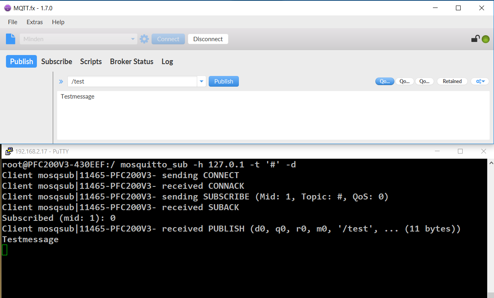

# PFC Mosquitto Broker - Client
Add a local mosquitto broker and client on PFC G1/G2 or TP600 devices.

** Changed => Now with TLS Support **

# mosquitto-ipk
This repo contains an ipk file to add a local mosquitto broker and client on Wago devices.
- Wago <a href="https://github.com/WAGO/pfc-mosquitto-broker/blob/master/mosquittoBroker_1.4.14_armhf.ipk" title="MQTT.ipk">mosquittoBroker.ipk</a>
  

# How to install MQTT Broker - Client on Wago devices.

## Prerequisites for tutorial
- Wago PFC or Wago Touch Panel with min. firmware 12 or higher installed in flash. 
- PC with preinstalled SSH Client (e.g. https://www.putty.org/)
- Web browser of your choice. (e.g. chrome).


## Installation

1. Start Wago PFC.
2. Open WBM (Web Base Management) menu "*Software Uploads*".
3. Press "*Browse*" button and navigate to wago mosquitto_x.x.x.ipk file. (e.g. mosquitto_1.4.14_armhf.ipk)
4. Then press "*Start Upload*" button.
5. After finishing the upload process, press "*Submit*" button to activate the software package. 
6. Just ignore possible error messages. 

## PFC Login
Start SSH Client e.g. Putty 
 ```bash
login as `root`
password `wago`
 ```
## Check mosquitto-broker-client installation

```bash
mosquitto --version
 ```
## Add a local 'sub' topic inside console

```bash
mosquitto_sub -h 127.0.0.1 -t '#' -d
 ``` 
 Use an MQTT client to send to broker.
 For example MQTTfx: https://mqttfx.jensd.de/
 
 <div style="text-align: center">

</div>

## Known issues


## Links
 1. <a href="https://www.wago.com/de/" title="wago">https://www.wago.com/de/</a>
 2. <a href="https://mqttfx.jensd.de/" title="MQTTfx">https://mqttfx.jensd.de/</a>
 3. <a href="https://www.putty.org/" title="MQTTfx">https://www.putty.org/</a>

